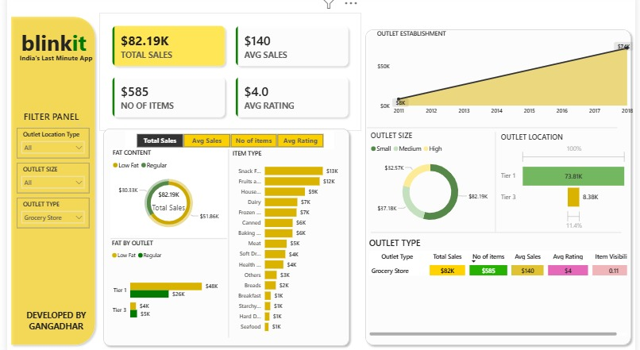
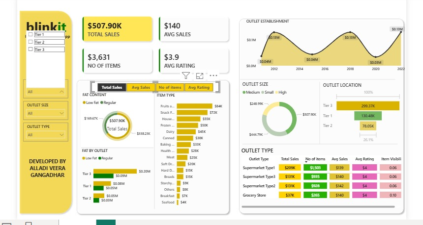
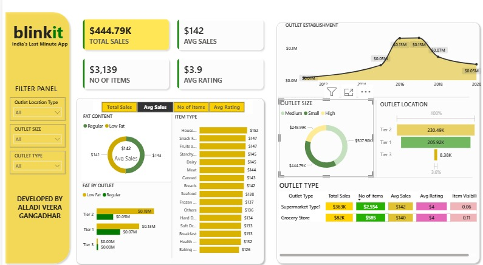
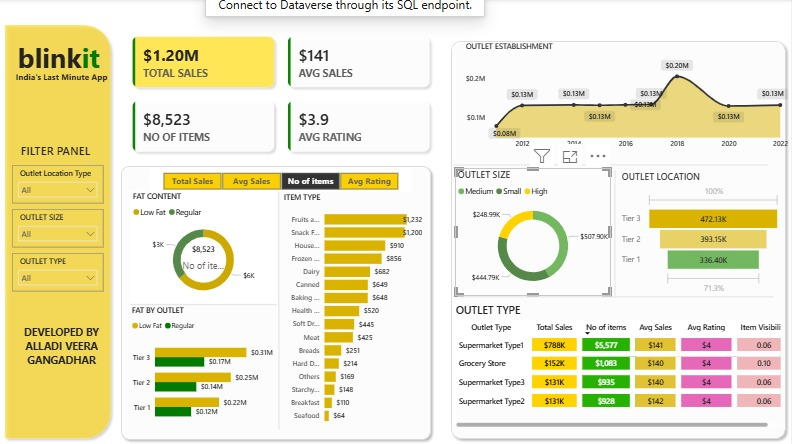

Blinkit Sales Analysis Dashboard

# BlinkIT Sales Analysis Dashboard

## Project Overview

This project presents an interactive Power BI dashboard developed to analyze BlinkIT grocery sales data. The dashboard provides insights into sales performance, outlet characteristics, product categories, and customer ratings to support data-driven business decisions.

## Objective

The main objective of this project is to:

- Analyze overall sales performance.
- Identify top-performing product categories.
- Compare sales across outlet types and locations.
- Evaluate outlet size and establishment trends.
- Monitor customer ratings and item visibility.

## Tools & Technologies Used

- Power BI
- Microsoft Excel
- Power Query
- DAX (Data Analysis Expressions)

## Dataset

The dataset contains grocery sales information including:

- Item Type
- Outlet Type
- Outlet Size
- Outlet Location
- Sales
- Ratings
- Establishment Year

Dataset File:
- `BlinkIT Grocery Data.xlsx`

## Key Performance Indicators (KPIs)

| KPI | Value |
|------|------|
| Total Sales | $1.20M |
| Average Sales | $141 |
| Number of Items | 8,523 |
| Average Rating | 3.9 |

## Dashboard Screenshots

### Dashboard Overview

### Sales Analysis

### Outlet Analysis

### Product Analysis

## Key Insights

### Sales Performance
- Total sales reached approximately **$1.20M**.
- Average sales per transaction were **$141**.
- More than **8,500 items** were analyzed.

### Outlet Performance
- Tier 3 outlets generated the highest sales revenue.
- Medium-sized outlets contributed a significant portion of total sales.
- Sales remained relatively stable across outlet establishment years.

### Product Analysis
- Fruits, Snacks, and Household products were among the top-performing categories.
- Low-fat and regular-fat products showed different purchasing patterns.

### Customer Satisfaction
- Average customer rating remained around **3.9**, indicating generally positive customer feedback.

## Business Recommendations

- Increase inventory for high-performing product categories.
- Focus expansion efforts on high-performing outlet locations.
- Improve visibility for lower-performing product categories.
- Continue monitoring customer ratings to maintain service quality.

# Files Included

- `data analyst 1st project.pbix` – Power BI dashboard file
- `BlinkIT Grocery Data.xlsx` – Source dataset
- Dashboard screenshots
- README documentation

## Author

**Veeragangadhar**

GitHub: https://github.com/Veeragangadhar
